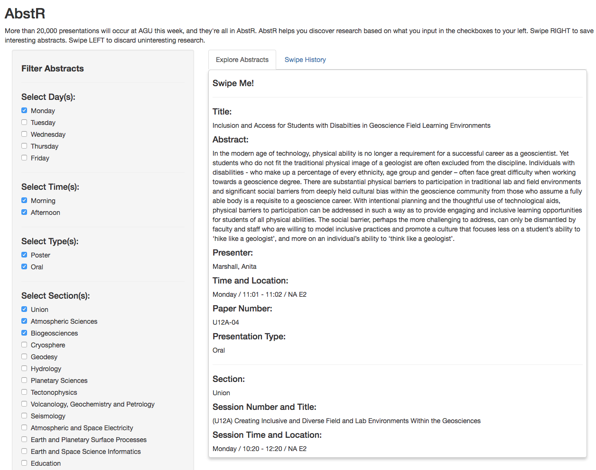

# AbstR

This R Shiny web application generates random abstracts from fields you define, and helps the user swipe through [American Geophysical Union](https://fallmeeting.agu.org/2017/) 2017 conference data. This app was inspired by [PapR](https://jhubiostatistics.shinyapps.io/papr/), a “tinder for academic preprints”.  

Data was obtained from the AGU Open API.  

I'm very grateful to Jeff Leek, Jeff Leek, Lucy D'Agostino McGowan, and Nick Strayer for their work on Paper, the app that inspired this creation. I'm also very appreciative for developers behind the awesome [`shinysense`](https://github.com/nstrayer/shinysense) library that brings incredible interactivity to shiny apps.  

  
*Click on the picture to visit the app.*
